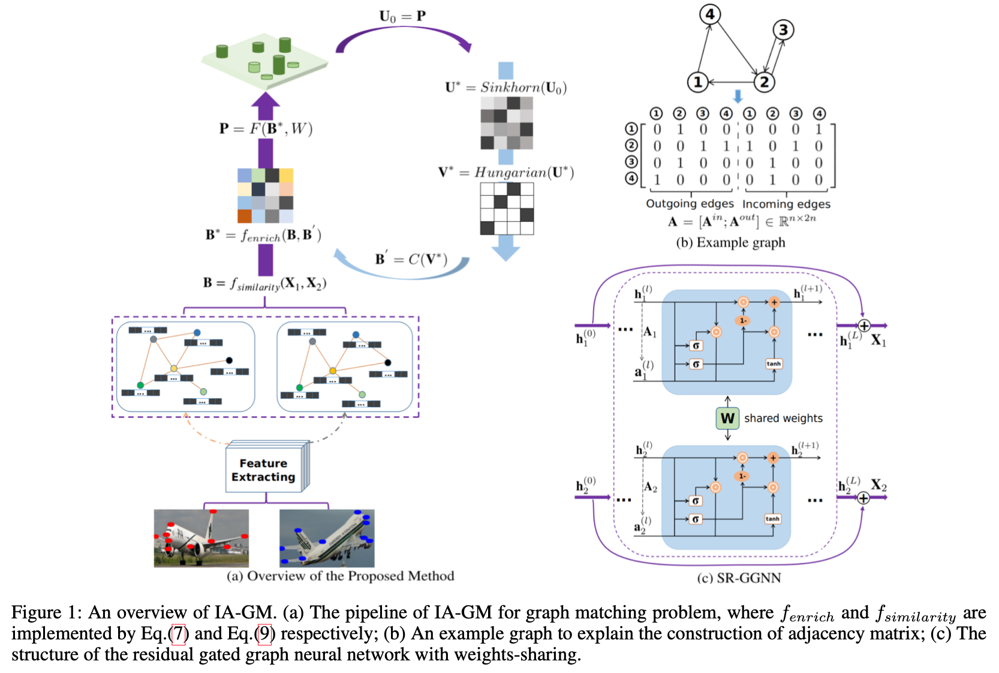

# IA-GM: **A deep bidirectional learning method for graph matching**				 				
Existing deep learning methods for graph matching (GM) problems usually considered affinity learning to assist combinatorial optimization in a feedforward pipeline, and parameter learning is executed by backpropagating the gradients of the matching loss. Such a pipeline pays little attention to the possible complementary benefit from the optimization layer to the learning component. In this paper, we overcome the above limitation under a deep bidirectional learning framework. Our method circulates the output of the GM optimiztion layer to fuse with the input for affinity learning. Such direct feedback enhances the input by a feature enrichment and fusion technique, which exploits and integrates the global matching patterns from the deviation of the similarity permuted by the current matching estimate. As a result, the circulation enables the learning component to benefit from the optimization process, taking advantage of both global feature and the embedding result which is calculated by local propagation through node-neighbors. Moreover, circulation consistency induces an unsupervised loss that can be implemented individually or jointly to regularize the supervised loss. Experiments on challenging datasets demonstrate the effectiveness of our methods for both supervised learning and unsupervised learning. 
 
This repository holds the Python implementation of the method described in the paper published in AAAI 2021.


Zhao, K., Tu, S., & Xu, L. (2021, May). IA-GM: A Deep Bidirectional Learning Method for Graph Matching. In Proceedings of the AAAI Conference on Artificial Intelligence (Vol. 35, No. 4, pp. 3474-3482).
​

## Content


1. Requirements
1. Available datasets
1. Training
1. Evaluation
1. Reference


## Requirements


- pytorch 1.1+ (with GPU support)
- ninja-build
- tensorboardX
- scipy
- easydict
- pyyaml


## Available datesets
### PascalVOC-Keypoint

1. Download [VOC2011 dataset](http://host.robots.ox.ac.uk/pascal/VOC/voc2011/index.html) and make sure it looks like `data/PascalVOC/VOC2011` 
1. Download keypoint annotation for VOC2011 from [Berkeley server](https://www2.eecs.berkeley.edu/Research/Projects/CS/vision/shape/poselets/voc2011_keypoints_Feb2012.tgz) or [google drive](https://drive.google.com/open?id=1D5o8rmnY1-DaDrgAXSygnflX5c-JyUWR) and make sure it looks like `data/PascalVOC/annotations`
1. The train/test split is available in `data/PascalVOC/voc2011_pairs.npz`


Please cite the following papers if you use PascalVOC-Keypoint dataset:
```
@article{EveringhamIJCV10,
  title={The pascal visual object classes (voc) challenge},
  author={Everingham, Mark and Van Gool, Luc and Williams, Christopher KI and Winn, John and Zisserman, Andrew},
  journal={International Journal of Computer Vision},
  volume={88},
  pages={303–338},
  year={2010}
}

@inproceedings{BourdevICCV09,
  title={Poselets: Body part detectors trained using 3d human pose annotations},
  author={Bourdev, L. and Malik, J.},
  booktitle={International Conference on Computer Vision},
  pages={1365--1372},
  year={2009},
  organization={IEEE}
}
```
### Cars and Motorbikes dataset


1. This dataset is available in `data/PAC`.


Please cite the following paper if you use Cars and Motorbikes dataset:
```
@article{everingham2009pascal,
  title={The PASCAL visual object classes challenge 2007 (VOC2007) development kit},
  author={Everingham, Mark and Winn, John},
  year={2009},
  publisher={Citeseer}
}
```
### CMU House/Hotel dataset


1. This dataset is available in `data/[Cmu-hotel-house](https://github.com/CMACH508/2021-IA-GM/tree/5d4b8ea5f8bba52622a0db7906d66ff830c652bc/data/Cmu-hotel-house)`.


Please cite the following paper if you use CMU House/Hotel dataset:
```
@article{caetano2009learning,
  title={Learning graph matching},
  author={Caetano, Tib{\'e}rio S and McAuley, Julian J and Cheng, Li and Le, Quoc V and Smola, Alex J},
  journal={IEEE transactions on pattern analysis and machine intelligence},
  volume={31},
  number={6},
  pages={1048--1058},
  year={2009},
  publisher={IEEE}
}
```


## Training


As an example, after putting data source file to the data folder, you can simply run:


`python train_xxx.py --cfg path/to/your/yaml`


-  For VOC2011 dataset: `python train_ia.py --cfg model_ia.yaml` 
-  For Cars and Motorbikes dataset: `python train_ia.py --cfg biia_pac.yaml` 
-  For CMU House/Hotel dataset: `python train_unsup.py --cfg unsup_cmu.yaml` 


## Evaluation


Run evaluation on epoch `k`:


`python eval_xxx.py --cfg path/to/your/yaml --epoch k`
​

## Reference


Please cite our work if you find our code/paper is useful to your work.


```
@inproceedings{zhao2021ia,
  title={IA-GM: A Deep Bidirectional Learning Method for Graph Matching},
  author={Zhao, Kaixuan and Tu, Shikui and Xu, Lei},
  booktitle={Proceedings of the AAAI Conference on Artificial Intelligence},
  volume={35},
  number={4},
  pages={3474--3482},
  year={2021}
}
```
